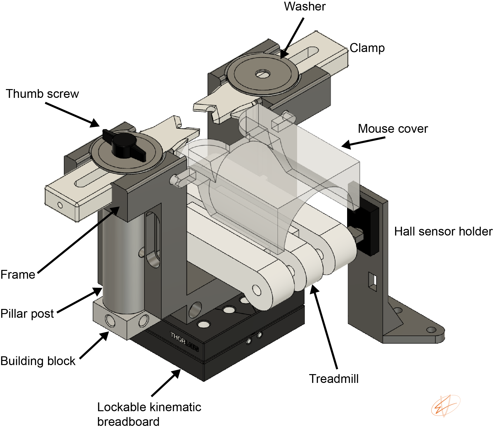

---
# An instance of the About widget.
# Documentation: https://wowchemy.com/docs/page-builder/
widget: Head-fixed setup

# Activate this widget? true/false
active: true

# This file represents a page section.
headless: true

# Order that this section appears on the page.
weight: 20

title: 'Head-fixed setup'

# [design.spacing]
# Customize the section spacing. Order is top, right, bottom, left.
css_style: "padding-top: 20px; padding-bottom: 20px;"

# design:
#   background:
#       gradient_start: '#4bb4e3'
#       gradient_end: '#2b94c3'
#       gradient_angle: 180

# Choose the user profile to display
# This should be the username (folder name) of a profile in your `content/authors/` folder.
# See https://wowchemy.com/docs/get-started/#introduce-yourself
author: misiV
---
I have started to perform head-fixed experiments recently. I need to admit that it provides a fast and easy way to collect data. Some of the caveats are the limited time that the animal can be recorded and the lack of sleep. Just to give you a sense about the process using head-fixed animals. For our [paper](https://onlinelibrary.wiley.com/doi/full/10.1002/advs.202105414), we collected two sessions in February. After analyzing the data, we collected 9 more sessions in 8 days in May and submitted our paper within a few months.
 
The original idea of the treadmill was developed at the *Rinberg lab at NYU* and can be found [here](https://github.com/olfa-lab/Imaging-Treadmill). The Lego Tread Links enable the animal to run, but I have only used this design in studies in which the animal was not trained on any task. The Lockable Kinematic Breadboard allows you to secure the treadmill during recordings and release it quickly between sessions so it is easy to clean. 

Bill of materials is available [here](head_fixed_BOM.csv).

The .stl files are optimized for Ultimaker S5 printer. For other printers, some modifications may be necessary.

**HEAD-POSTS**
 
Head-posts are attached to the animal's skull. Head-posts compatible with this design can be found here: https://github.com/olfa-lab/Imaging-Treadmill/tree/main/DiamondPost

**MEASURING MOTION**
 
Hall effect sensor can be used to measure the rotary position of an external magnet attached to the Lego rod. The output of the sensor should be connected to an analog input on your data acquisition system. 

**CITATION**
 
The original idea of the head-posts is described in the following paper.
 
RIVETS: a mechanical system for in vivo and in vitro electrophysiology and imaging, Jason E. Osborne, Joshua T. Dudman, PlosOne, 2014
 
The designs are desitributed under GNU GPLv3 license.