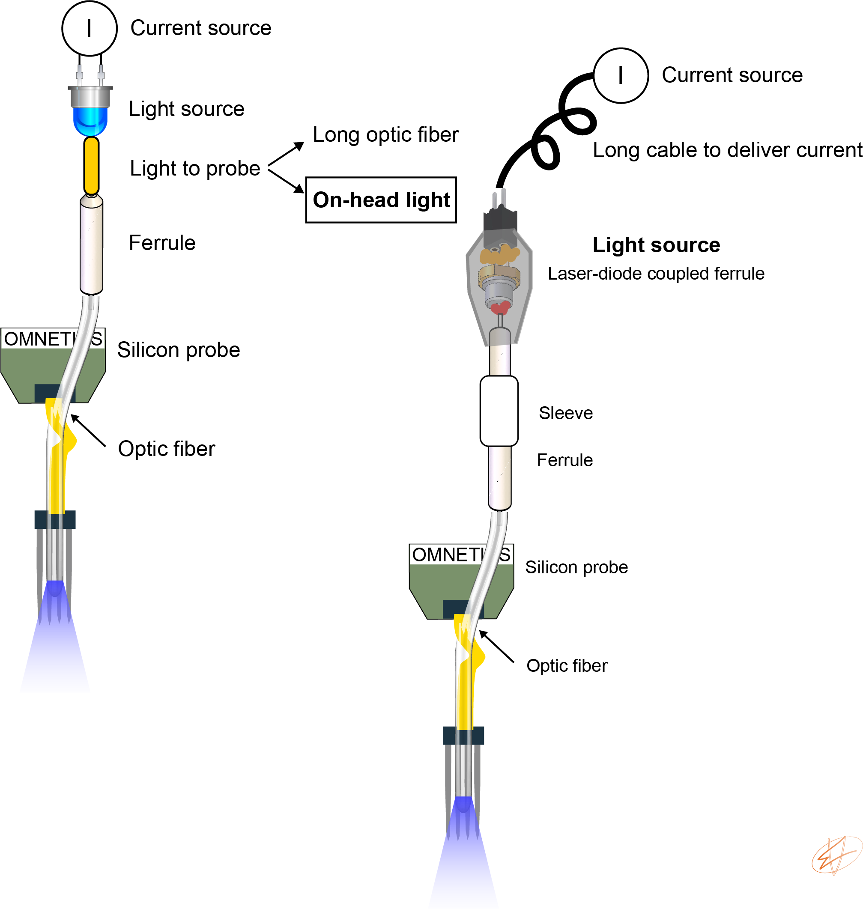
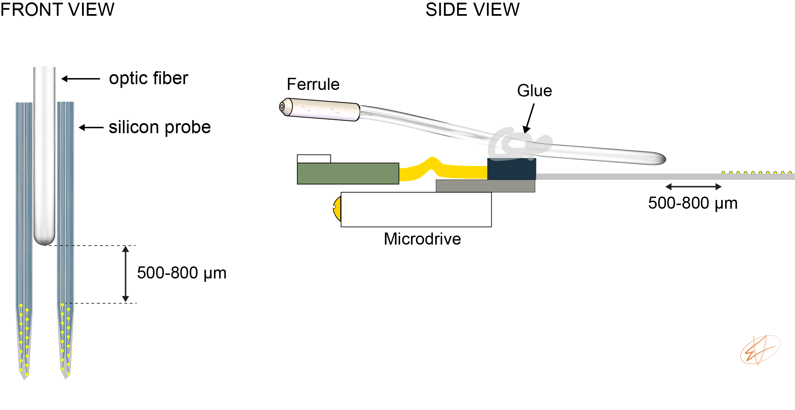
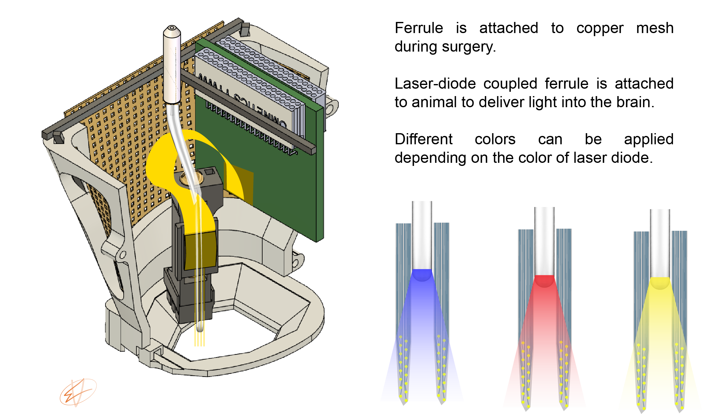
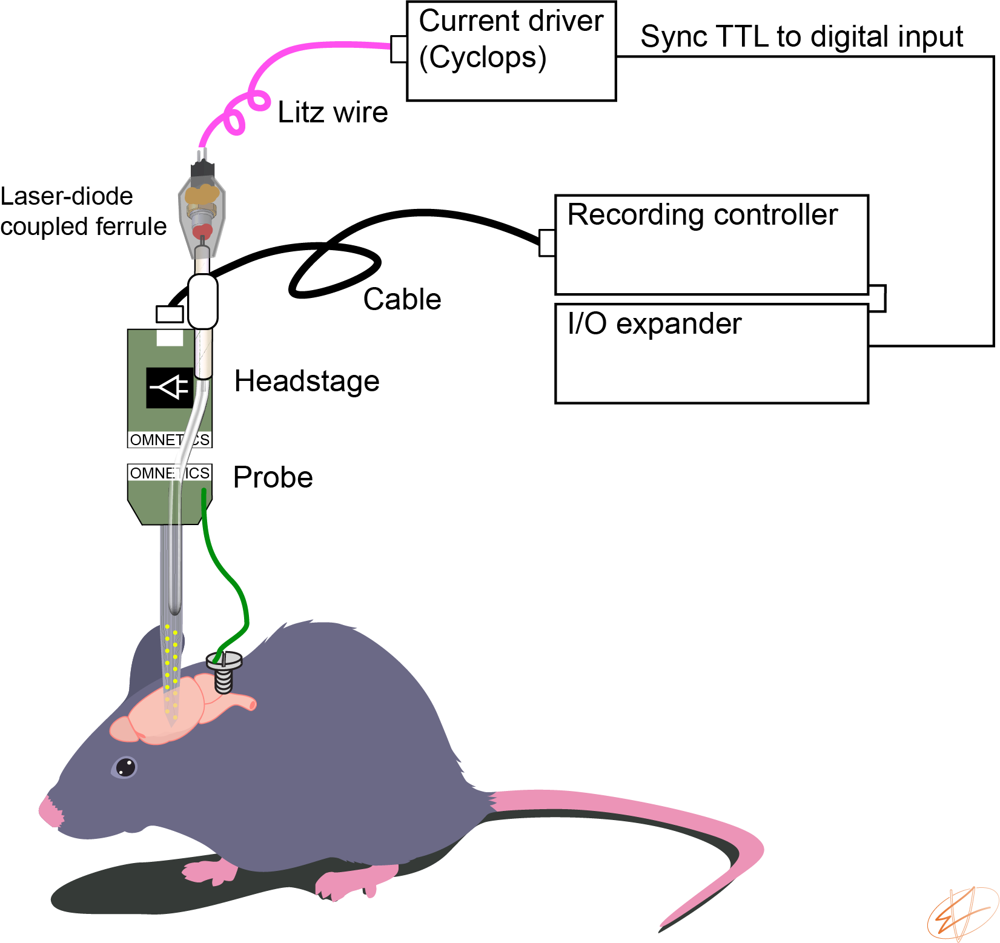

---
# An instance of the About widget.
# Documentation: https://wowchemy.com/docs/page-builder/
widget: optotagging

# Activate this widget? true/false
active: true

# This file represents a page section.
headless: true

# Order that this section appears on the page.
weight: 20

title: 'Optotagging in freely moving animals'

# [design.spacing]
# Customize the section spacing. Order is top, right, bottom, left.
css_style: "padding-top: 20px; padding-bottom: 20px;"

# design:
#   background:
#       gradient_start: '#4bb4e3'
#       gradient_end: '#2b94c3'
#       gradient_angle: 180

# Choose the user profile to display
# This should be the username (folder name) of a profile in your `content/authors/` folder.
# See https://wowchemy.com/docs/get-started/#introduce-yourself
author: misiV
---
### Outline
1. Build an optrode
2. Equipments
3. Optotagging

### Build an optrode
An optic fiber is positioned above the recording sites to monitor neuronal activity and deliver light for optogenetic stimulation simultanously in a spatially confined manner (**Fig. 1.**). To deliver light, we need a light source driven by a current source. To enable free movement of the animal, we place the light source on top of the animal's head during recording sessions. This light source is a *Laser-diode coupled ferrule*. Instructions on how to couple lightweight diodes to optical fibers can be found [here](Laser_diode_for_freely_moving_optogenetics.pdf).
 
 
This method allows fast multisite, multicolor optogenetic manipulations in behaving animals and concurrent monitoring of the manipulated neurons without limiting free movement of the animal. The original idea was described in [Stark, 2012](https://journals.physiology.org/doi/full/10.1152/jn.00153.2012). 

To attach the optic fiber to the silicon probe, we use two 3-axis micromanipulators to align the fiber tip with the probe shanks. Typically, we try to position the tip of the fiber 500-800 μm away from the top recording channel (**Fig. 2.**). We also try to angle the fiber a little bit so light is shined on the surface of the contact site (but this depends on the light pattern of the fiber tip). Note that the probe is already attached to the microdrive and the fiber is glued to the probe backend using optical glue. 

**How long the optical fiber should be?** This depends on the depth of the target brain region. During surgery, we attache the ferrule to the copper mesh cage (**Fig. 3.**). If the fiber is too long, then it can brake easily. If it is too short, then we cannot move the microdrive in the z-axis, preventing us to reach the target depth. 

### Equipments
We use [RHD USB interface board](https://intantech.com/RHD_USB_interface_board.html) from Intan Technologies to record neuronal activity. We use [Cyclops](https://open-ephys.org/cyclops) from OpenEphys to deliver current to our laser diodes. We record the TTL signal from the current driver using a digital input on the DAQ to synchronize electrophysiology with optogenetics. 

### Optotagging
First, we need to find the correct light intensity to evoke spiking. We use five light pulses with increasing light intensity and 2 seconds interpulse intervals to calibrate light intensities. We want to see evoked spiking, but no local field potential (LFP) deflection that would reflect a population effect. Once the proper light intensity is found, we deliver 3000 pulses (2 ms duration, 200 ms inter-pulse interval), at the end of the recording session. Sharp onsets and offsets are associated with a photoelectric artifact. To prevent such artifacts from propagating to spike sorting and unit identification, raw data are over the stimulus interval shortly before the onset (0.15 ms) and after the offset (0.8 ms) of each brief pulse. (I learned this protocol from Roman Huszár and Sam McKenzie in the Buzsaki lab).